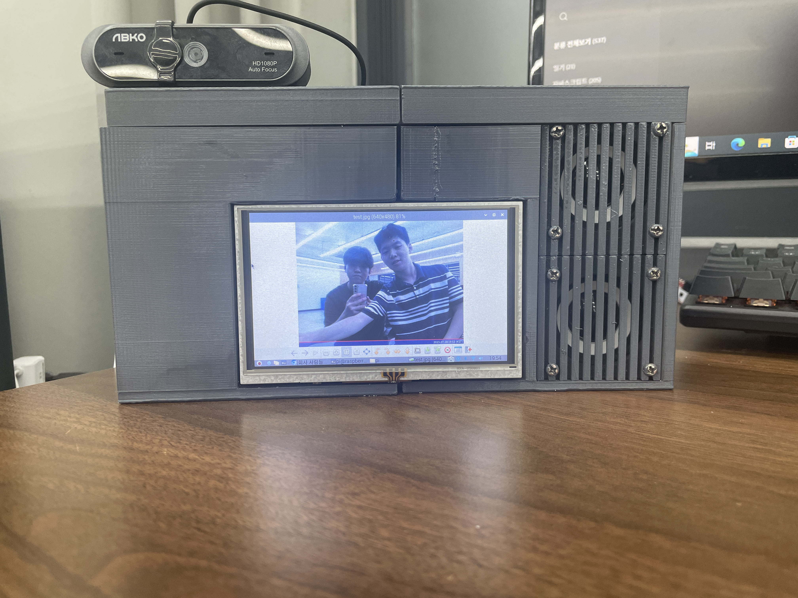

# 💊 PHAROS (파로스)

  

 

## 🌟 1. 프로젝트 소개 (Introduction)

### 1.1. 문제 정의 (Problem Statement)

노약자나 시각장애인은 일반적인 약품 포장에 인쇄된 작은 글씨나 복잡한 복용 정보를 정확하게 인지하기 어렵습니다. 이는 단순한 불편함을 넘어, 약물 오용으로 인한 건강상의 위험을 초래할 수 있습니다.

**PHAROS**는 이러한 정보 접근성 문제를 해결하기 위해 고안된 **AI 기반의 약품 인식 및 음성 안내 독립형 서비스 기기**입니다. 사용자가 약품을 기기에 올리면, 즉시 정확한 정보를 음성으로 안내하여 약물 오용을 방지하고 안전한 복용을 돕습니다.

### 1.2. 목표 및 기대 효과 (Goals & Impact)

* **정보 격차 해소:** 시각적 정보에 취약한 사용자가 독립적으로 약품 정보를 획득하게 합니다.
* **약물 오용 방지:** 복용 주기, 횟수, 주의사항 등 필수 정보를 명확하게 안내하여 오용을 줄입니다.
* **생활 편의 증진:** 약품 안내 외에도 AI 비서 기능을 제공하여 일상생활의 유용한 도구로 활용됩니다.

---

## 💡 2. 주요 기능 상세 (Detailed Features)

| 기능 카테고리 | 기능명 | 상세 내용 |
| :--- | :--- | :--- |
| **핵심 인식** | **AI 기반 약품 인식** | 웹캠을 통해 약품 이미지를 획득하고, **YOLO-V5 모델**을 활용하여 약품의 종류를 정확하게 식별합니다. |
| **사용자 인터페이스** | **음성 입출력 시스템** | **STT(Speech-to-Text)**를 통해 사용자의 명령(약품 조회, 일반 질문)을 인식하고, **TTS(Text-to-Speech)**를 통해 모든 정보를 음성으로 출력하여 시각적 제한을 완전히 해소합니다. |
| **비서 서비스** | **지능형 Q&A (GPT-3)** | 약품 안내 서비스 외에도 OpenAI의 **`text-davinci-003` API**를 연동하여 사용자의 일반적인 질문에 답변하는 AI 비서 역할을 수행합니다. |
| **보조 기능** | **맞춤형 복용 알림** | 복용 데이터를 기반으로 정해진 시간에 알람을 울려 사용자가 약물 복용 시간을 놓치지 않도록 지원합니다. |
| **화면 출력** | **터치 스크린 GUI** | 터치 스크린을 통해 인식 결과, 복용 정보, AI 비서 응답 내용 등 핵심 정보를 텍스트로도 시각화하여 비장애인 사용자의 편의성도 확보합니다. |

---

## 💻 3. 기술 스택 및 시스템 아키텍처 (Tech Stack & Architecture)

### 3.1. 하드웨어 구성 (Hardware Components)

PHAROS는 **Raspberry Pi 3**를 메인 제어 장치로 하여 다음과 같은 주변 장치를 연결하여 구성됩니다.

| 장치 | 역할 | 비고 |
| :--- | :--- | :--- |
| **메인 컨트롤러** | Raspberry Pi 3 | STT, TTS, Socket 통신 관리 및 전체 서비스 흐름 제어 |
| **이미지 입력** | USB 웹캠 | 약품 이미지를 획득하는 역할 |
| **음성 입력** | 소형 마이크 | 사용자의 음성 명령(Wake-up Word, 서비스 요청) 수신 |
| **출력 장치** | 스피커 및 터치 스크린 모니터 | TTS 음성 안내 및 GUI 화면 출력 담당 |

### 3.2. 소프트웨어 스택 (Software Stack)

| 모듈/API | 목적 | 상세 내용 |
| :--- | :--- | :--- |
| **YOLO-V5** | **객체 인식/분류** | 약품의 이미지 데이터를 학습하여 빠르고 정확하게 약품을 식별 (Image Classification) |
| **Socket 통신** | **데이터 송수신** | 라즈베리 파이(Client)와 별도 PC(Server, 무거운 ML 작업 처리) 간의 이미지 및 인식 결과를 비동기적으로 주고받습니다. |
| **OpenAI GPT API** | **AI 비서** | 일반 지식에 대한 사용자 질문에 응답 (API 버전: `text-davinci-003` 사용) |
| **STT 모듈** | **음성 인식** | Python `Speech_Recognition` 모듈, Google STT API 연동 |
| **TTS 모듈** | **음성 합성** | Python `GTTS` 모듈을 사용하여 텍스트를 음성 파일로 변환 후 `Playsound` 또는 Linux `mpg123`를 통해 출력 |

---

## ⚙️ 4. 시스템 작동 흐름 (Detailed Service Flow)

PHAROS 서비스는 라즈베리 파이를 중심으로 아래와 같은 6단계의 프로세스로 작동합니다.

1.  **Wake-Up/명령 대기:** 기기는 평상시 AI 비서 상태로 대기합니다. 사용자가 설정된 호출어(`메딕` 등)를 외치면 STT 시스템이 활성화됩니다.
2.  **명령 수신 및 파싱:** 사용자의 음성 명령을 마이크로 녹음하고, `Speech_Recognition` 모듈을 통해 텍스트로 변환합니다. 변환된 텍스트를 파싱하여 **(1) 약품 인식 요청** 또는 **(2) 일반 Q&A 요청**인지 구분합니다.
3.  **약품 인식 서비스 요청 (경우 1):**
    * 웹캠으로 약품 이미지를 캡처합니다.
    * 이 이미지 데이터를 **Socket 통신**을 통해 고성능의 외부 PC (ML 서버)로 전송합니다.
    * 외부 PC는 수신된 이미지에 대해 YOLO-V5 모델을 실행하여 약품을 인식합니다.
4.  **AI 비서 서비스 요청 (경우 2):**
    * 질문 텍스트를 GPT API (`text-davinci-003`)로 전송하고, 답변을 수신합니다.
5.  **결과 수신 및 통합:**
    * (경우 1) 외부 PC로부터 인식된 약품명과 데이터베이스에서 조회한 상세 복용 정보를 수신합니다.
    * (경우 2) GPT API로부터 답변 텍스트를 수신합니다.
6.  **정보 출력:** 최종 텍스트 정보를 `GTTS` 모듈로 전달하여 음성으로 변환하고, 스피커를 통해 사용자에게 안내합니다. 동시에 터치 스크린에 해당 내용을 출력합니다.

---

## 🚀 5. 향후 개발 계획 (Future Development Roadmap)

* **웹 기반 UI 구축:** 현재의 기본 GUI를 대체할 HTML, CSS, JavaScript 기반의 반응형 웹 UI를 개발하여, 음성 대화 기록, 실시간 카메라 화면, 상세 약품 정보를 웹브라우저에서 통합적으로 제공할 예정입니다.
* **음성 처리 최적화:** `Recognize_google` API 사용 시 발생하는 딜레이 및 소음 환경에서의 인식률 저하 문제를 개선하기 위해, **DeepSpeech**와 같은 경량화된 오프라인 STT 모델 적용을 검토합니다.
* **기기 모듈화 및 경량화:** Raspberry Pi 4 또는 Zero 2 W 등 보다 고성능이면서 소형화된 하드웨어로 교체하여 기기의 부피와 무게를 줄이고, 휴대성을 높이는 방안을 모색합니다.
* **데이터베이스 확장:** 약품 이미지 및 정보 데이터베이스를 지속적으로 업데이트하여 인식률과 정보의 정확성을 확보합니다.

---

## 📄 6. 라이선스 (License)

이 프로젝트는 [MIT License](https://opensource.org/licenses/MIT)를 따릅니다.

---

## 📑 7. 참고 문서 (Reference Document)

이 `README.md`는 다음 작품설명서를 기반으로 작성되었습니다.

* **PHAROS 작품설명서:** [https://docs.google.com/document/d/177tYrA-3U1_WWjoA-0rwIq4rj3mSwdDZ4eoeYMJlWTU/edit?pli=1&tab=t.0](https://docs.google.com/document/d/177tYrA-3U1_WWjoA-0rwIq4rj3mSwdDZ4eoeYMJlWTU/edit?pli=1&tab=t.0)
